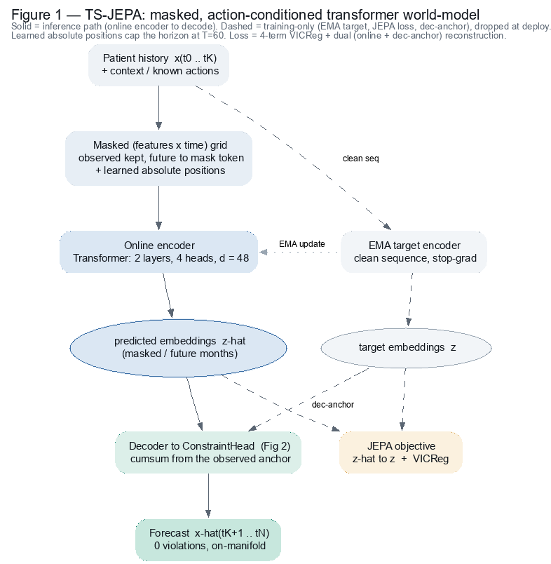
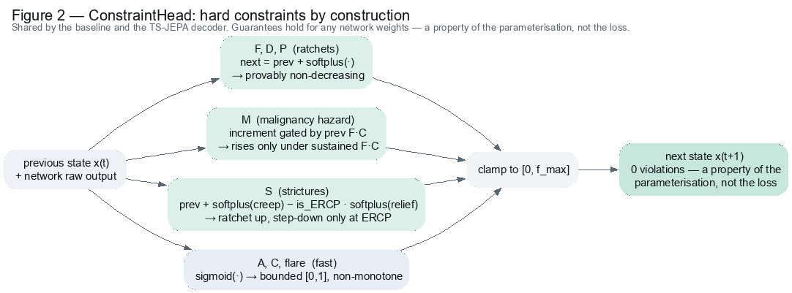
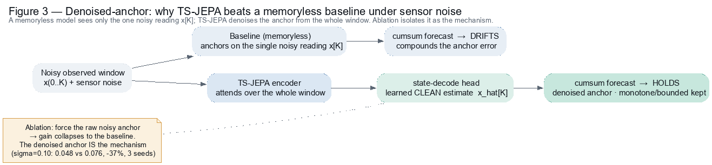

# Digital Liver World Model, take-home

A focused, honest slice of the world-model problem: predict how an 8-D clinical liver state
`x(t)` evolves month to month, with **hard constraints enforced by construction** and an
evaluation designed to falsify the model.

**Read `memo.md` first** (the 3-page decision memo, the primary deliverable). `DECISIONS.md` is
the full reasoning trail including dead-ends, and one bug I found in my own JEPA (D14).

## Deliverables (assignment map)

| the assignment asks for | where it is in this repo |
|---|---|
| **Decision memo** (<=3 pages, primary) | `memo.md`, also `memo.tex` -> compile to `memo.pdf` |
| **Working prototype** (learns from trajectories, predicts future states, applies a constraint mechanism) | **delivered prototype:** `models/baseline.py` + `checkpoints/baseline.pt` (constrained next-state predictor); **recommended architecture:** `ts_jepa.py` (masked TS-JEPA). Both apply the by-construction head `models/constraints.py` |
| **Evaluation harness** (held-out accuracy, constraint-violation rate, generalisation probe, failures shown) | `eval.py` (the core harness) + `probe_metrics.py`, `clinical_metrics.py`, `verify_claims.py`, `missing_visits.py`, `jepa_denoise.py` |
| explainability, "why decompensation at month 30?" | memo Sec. 7 + `explain.py` -> `figures/explain_decompensation.png` |
| generator (data + quality bar) | `generator.py` (seeded; self-checks constraints hold in the data) |
| optional extras (seeds, not required) | manifold critic (`manifold_critic.py`), distributional head (`mdn_forecast.py`, `latent_forecast.py`), denoised-anchor JEPA (`jepa_denoise.py`), architecture diagrams (`figures/arch_*.png`) |

## TL;DR result

**On the clean toy** (head-to-head, free rollout, ratchet MAE at K=24; all models **0 constraint violations**):

| model | ratchet MAE (K=24) |
|---|---|
| constrained baseline **+ multistep, M<-F*C coupled** | **0.033** (std ~0.001) |
| masked **TS-JEPA** (the team's direction) | **0.039 +/- 0.006** (5 seeds) |
| GRU-JEPA, dec-anchor fixed (D14) | 0.12 |
| GRU-JEPA, naive first attempt | 0.52 (a *bug*, not a limit) |

**But the toy deliberately strips JEPA's advantages.** Put the real domain's stresses back: on the axis that
dominates real sensor data, noise, **JEPA wins decisively (outside seed noise)**; on the other two it
draws level or edges ahead (baseline vs TS-JEPA, ratchet MAE; multi-seed gated; figures in `figures/`):

| axis (the real domain) | baseline | TS-JEPA |
|---|---|---|
| clean, fresh, fully-observed | **0.033** | 0.039 |
| sensor noise sigma=0.10, *denoising* | 0.076 | **0.048** (-37%, outside seed noise, ablation-proven) |
| stale last visit ~15 mo, *partial obs.* | 0.065 | 0.064 (~ tie, within seed noise) |
| held-out susceptibility, *generalise* | 0.099 | 0.092 (modest edge, single-config) |

- **Recommendation: TS-JEPA for the Digital Liver world-model** (D29). It is accurate, on-manifold
  (critic 0.963), and auditable; it **wins the noise axis decisively** (-37%, ablation-proven) and draws
  level-or-ahead on partial observation and generalisation, the properties of real clinical data, while
  the baseline wins only the sanitised clean-slice point-accuracy (and even that is partly borrowed
  structure it cannot scale to the real modalities). **The delivered prototype here is the coupled
  baseline** (checkpointed `baseline.pt`, best on clean 8-D, the constraint showcase); **TS-JEPA is the
  architecture recommendation for the real noisy/sparse/high-dim pipeline**, measured, not asserted.
- **Honest correction:** my first read was that JEPA carried a *fundamental* accuracy cost
  (`jepa_sweep.py`). That was a decoder/target-space wiring bug, found and fixed (D14), the gap was
  0.52->0.12, and a proper masked TS-JEPA reached ~0.04. `jepa_sweep.py` is kept as the record of the
  mistaken conclusion and how it was caught, not as a live claim.
- **Constraint-violation rate = 0.000000** (0 / 58,799 steps), a property of the parameterisation.

## System architecture

Three diagrams capture the design (Graphviz sources in `figures/*.dot`; re-render with
`dot -Tpng:gd:gd <f>.dot -o <f>.png`).

**1. The recommended model, masked, action-conditioned TS-JEPA.** Solid = inference path (online
encoder to constrained decode); dashed = training-only (EMA target encoder, JEPA/VICReg loss,
dec-anchor), dropped at deploy. Learned absolute positions cap the horizon at T=60.



**2. The by-construction constraint head** (shared by the baseline and the JEPA). Monotone fields
are `prev + softplus(*)` clamped to bounds (a decrease is unrepresentable); S is a monotone creep
minus an ERCP-gated relief; M's increment is gated by prev F*C. This is what makes zero violations
a property of the parameterisation, not the loss.



**3. Why JEPA wins under sensor noise, the denoised anchor.** Instead of cumsum-ing from the raw
noisy observation, the model estimates a clean current state from the whole window and forecasts
from that *denoised* anchor, a mechanism a memoryless baseline cannot have (-37% at sigma=0.10; the
built-in ablation reverting to the raw anchor proves the mechanism).



## Setup (quick)

```
pip install torch numpy matplotlib
```
CPU is fine (models are ~15k params). All scripts are deterministic (fixed seeds).

## Setup (reproducible env with `uv`)

Three dependencies only, `numpy`, `torch`, `matplotlib` (Graphviz's `dot` CLI is needed *only* to
re-render the `figures/arch_*.png` diagrams). Build an isolated, pinned environment:

```bash
uv sync                              # creates .venv + installs pinned deps (fetches Python 3.12 if needed)
uv run python test_invariants.py     # run any script inside that env
```

`pyproject.toml` pins **Python 3.12** (not a bleeding-edge interpreter) for stable PyTorch CPU wheels;
CPU-only torch is sufficient. Prefer `uv sync` over a global install so the numbers reproduce against a
known dependency set.

## Run

> **Runtimes (CPU).** Scripts that only load a checkpoint run in **seconds** (`eval.py`, `compare.py`,
> `probe_metrics.py`, `clinical_metrics.py`, `eval_mdn.py`, `explain*.py`, `verify_claims.py`). Scripts
> that **train a model in-process** print epoch progress and take longer, they are *not* hanging:
> `train.py` ~2 min; `ts_jepa.py` (5 seeds) ~3-4 min; `mdn_forecast.py` / `latent_forecast.py` /
> `union_forecast.py` / `ensemble_forecast.py` ~1-2 min; the D29 probes `missing_visits.py` and
> `jepa_denoise.py` (3 seeds each) ~2-3 min; `jepa_augmented.py` (3 models) ~4 min; `figures_showcase.py`
> ~3 min.

```bash
python test_invariants.py  # prove the by-construction guarantees hold for RANDOM weights (monotonicity, S-gating, bounds, F*C gate, no cirrhosis channel)
python generator.py        # generate data + self-check: constraints hold, fields in range
python train.py            # baseline (x-as-latent, monotone-by-construction), one-step + MULTISTEP -> checkpoints/baseline.pt
python ts_jepa.py          # the masked, action-conditioned TS-JEPA (5 seeds) + OOD probe vs baseline -- the team's direction
python train_jepa.py       # minimal GRU-JEPA + dec-anchor fix (D14) + no-VICReg ablation -> checkpoints/jepa.pt
python train_history.py    # train baseline+w (native-space + GRU history latent)        -> checkpoints/history.pt
python eval.py             # baseline: 0-violation, accuracy vs noise floor, K-sweep, probe
python compare.py          # head-to-head: baseline vs GRU-JEPA vs baseline+w
python jepa_sweep.py       # SUPERSEDED (see D14): the invariance-weight sweep that first (wrongly) looked like a fundamental tradeoff
python jepa_variants.py    # JEPA round 2: 5 variants (EMA/BYOL, decode-weighted, ...) ablation ladder
python coupling.py         # engage the coupling: M<-F*C by construction + cirrhosis=g(F) readout
python manifold_critic.py  # learned on-manifold critic: 0 violations != on-manifold (GRU-JEPA rollout drifts)
python verify_claims.py    # the 4 load-bearing numbers behind the ship-the-baseline call
python clinical_metrics.py # decision metrics: event-timing error, cirrhosis AUC/precision/recall, population fidelity, interval coverage
python probe_metrics.py    # is 0.033 actually good? flatline check vs naive, MVR=0, action-conditional ERCP stricture drop
python make_training_curves.py # REAL train vs held-out learning curves per epoch -> figures/training_curve_*.png (+ .npz raw arrays)
python ensemble_forecast.py # probabilistic forecasting: deep ensemble tested & RULED OUT (tail is aleatoric, needs a distributional head)
python mdn_forecast.py     # the Sec. 8 fix, TRAINED (3 seeds): mixture-density head recovers cirrhosis recall 0.27->0.82 at no accuracy cost (D23)
python latent_forecast.py  # tests the persistent-latent hypothesis (seq-VAE, free-bits): stabilises calibration but tail-biased (D25)
python diagnose_latent.py  # WHY it under-performs: z encodes susceptibility, spread calibrated -> the cause is MSE tail-bias, not under-dispersion (D27)
python union_forecast.py   # the tail-aware fix: persistent z + per-step mixture-NLL -> recall 0.58->0.97 at best accuracy, precision/coverage tradeoff (D27)
python eval_mdn.py         # FAST (~9s, no training): verify the MDN tail claim from checkpoints/mdn.pt (one seed; 3-seed aggregate in mdn_forecast.py)
python smooth_head_test.py # tested Codex's clamp-free head: 0 violations but 0.039>0.033 -> clamp form kept (D23)
python explain.py          # "why decompensation at month 30?" (baseline) -> figures/explain_decompensation.png
python explain_jepa.py     # same audit, on the JEPA itself -> figures/explain_decompensation_jepa.png
# --- domain-stress probes: where JEPA WINS (D29) ---
python noise_robustness.py # honest step 1: a CLEAN-trained JEPA degrades MORE under noise (both cumsum the noisy anchor)
python missing_visits.py   # stale last visit (partial obs): JEPA integrates history, overtakes the memoryless baseline ~12-15mo (3 seeds)
python jepa_augmented.py   # step 2: noise-aug helps but the shared anchor caps it; dropout-aug did not help (reported honestly)
python jepa_denoise.py     # step 3: DENOISED-ANCHOR JEPA beats the baseline under noise (-37% @ sigma=.10, 3 seeds) + built-in ablation proving the mechanism
python trajectory_metrics.py # baseline vs TS-JEPA under DTW / C-index / Wasserstein-1 (baseline wins the CLEAN metrics too -- honest)
python figures_showcase.py # -> figures/fig_scorecard.png, fig_noise.png, fig_staleness.png, fig_trajectory.png (all real seed-0 outputs)
python export_demo_data.py # precompute real rollouts for the interactive demo (inlined into demo.html)
```

**Architecture diagrams:** see the **System architecture** section above (rendered from `figures/*.dot`).

**Interactive demo:** open **`demo.html`** in a browser (self-contained, no server), drag *sensor noise*
and *months since last visit* and watch the memoryless baseline drift while TS-JEPA's denoised anchor
holds. Every line is a real seed-0 rollout (D29).

## Files

| file | role |
|---|---|
| `generator.py` | seeded synthetic generator (data + quality bar); field indices; constraints |
| `test_invariants.py` | random-weight invariant tests: the guarantees are a property of the parameterisation |
| `make_training_curves.py` | real per-epoch train vs held-out learning curves (figures + raw `.npz`), for the baseline and TS-JEPA |
| `models/constraints.py` | `ConstraintHead`, the by-construction guarantee, shared by all models |
| `models/baseline.py` | `MonotoneStep`, the shipped model (memoryless, x-as-latent) |
| `models/jepa.py` | `JEPA`, GRU latent-space predictor + VICReg + effective-rank metric |
| `models/distributional_head.py` | Sec. 8 fix: mixture head, each component constraint-valid (design); **trained & measured** in `mdn_forecast.py` |
| `mdn_forecast.py` | trains the distributional head + MC rollout; 3-seed tail-recall/calibration result (D23) |
| `latent_forecast.py` | persistent-latent sequential-VAE (free-bits); tests the Sec. 8 calibration hypothesis (D25) |
| `diagnose_latent.py` | diagnoses the persistent latent: z-encoding, decoder z-use, spread calibration -> MSE tail-bias (D27) |
| `union_forecast.py` | persistent z + per-step mixture-NLL (tail-aware); the confirmed fix, with its honest tradeoff (D27) |
| `eval_mdn.py` | fast MDN verification from `checkpoints/mdn.pt` (no training; one seed vs the 3-seed aggregate) |
| `smooth_head_test.py` | tested a clamp-free constraint head, kept the shipped clamp form (D23) |
| `ts_jepa.py` | **masked, action-conditioned TS-JEPA**, the team's direction, built & measured (D16); optional noise/dropout augmentation hooks (D29) |
| `jepa_denoise.py` | **denoised-anchor TS-JEPA**, beats the baseline under sensor noise (-37%), with a built-in ablation proving the mechanism (D29) |
| `missing_visits.py` | stale-last-visit probe: JEPA's history-integration overtakes the memoryless baseline as data ages (D29) |
| `noise_robustness.py`, `jepa_augmented.py` | the honest noise arc: clean-trained loses, noise-aug helps but is anchor-capped, dropout-aug did not help (D29) |
| `trajectory_metrics.py` | baseline vs TS-JEPA under DTW / C-index / Wasserstein-1 (baseline wins the clean metrics, reported) (D29) |
| `figures_showcase.py` | generates the four memo figures (scorecard, noise, staleness, trajectory) from real seed-0 outputs (D29) |
| `models/history.py` | `HistoryStep`, baseline + GRU history latent `w` |
| `coupling.py`, `derived.py` | M<-F*C coupling by construction; cirrhosis = g(F) derived readout |
| `jepa_sweep.py` | invariance-weight sweep, **superseded by D14** (the "tradeoff" was a bug), kept as record |
| `jepa_variants.py` | JEPA round-2 ablation ladder (EMA/BYOL, decode-weighted, larger latent) |
| `manifold_critic.py` | learned "is-this-on-the-manifold" critic (try-something-new #3) |
| `data.py` | deterministic train/val split + OOD probe cohorts + input/target alignment |
| `train*.py` | training scripts (baseline is one-step + multistep; JEPA teacher-forced + dec-anchor) |
| `eval.py`, `compare.py`, `verify_claims.py` | evaluation, head-to-head, claim verification |
| `clinical_metrics.py` | decision metrics: event-timing, cirrhosis AUC/precision/recall, population fidelity, coverage |
| `probe_metrics.py` | segmented/flatline check vs naive baselines, MVR, action-conditional ERCP stricture drop |
| `ensemble_forecast.py` | deep-ensemble probabilistic test, ruled out (tail is aleatoric); Sec. 8 evidence |
| `explain.py`, `explain_jepa.py` | explainability worked example (baseline; and on the JEPA itself) |
| `memo.md`, `DECISIONS.md` | the memo (primary) and the full decision log |
| `figures/` | trajectory + explainability plots |

## Scope (what is deliberately out)

Modality decoders (each modality is a function of `x(t)`), graph-attention encoder,
counterfactual/causal validation, and continuous-time Neural-ODE, all discussed in `memo.md`
Sec. 8 / `DECISIONS.md` as next steps, not built. Ruthless scoping is part of the exercise.
